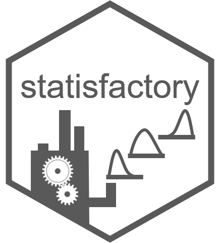

# statisfactory

This package contains various statistical tools and helper functions. You can install this package the usual way from `CRAN` or the development version (plus dependency `omnibus`) using:

`remotes::install_github('adamlilith/omnibus', dependencies=TRUE)`  
`remotes::install_github('adamlilith/statisfactory', dependencies=TRUE)`  

### Functions ###
## Utilities ##
* `makeFormulae`: Make all possible formula

## Distance ##
* `euclid`: Euclidean distance
* `fuzzyJaccard`: Fuzzy Jaccard index for non-binary values

## Calculations ##
* `geoMean`: Geometric mean
* `invLogitAdj`: Probit transform robust to 0's or 1's
* `logitAdj`: Logit transform robust to 0's and 1's
* `mmode`: Modal value
* `psum`: Element-wise sum (like pmin and pmax)
* `se`: Standard error of the mean

## Data transformation ##
* `art`: Aligned rank transform for using ANOVAs on rank data
* `rankMulti`: Rank values by multiple tie-breaking criteria

## Principal component analysis (PCA) ##
 *`backTransPCA`: "Back-transform" PCA scores to their original values

## Geometry
* `countConnected`: Count number of contiguous "blocks" of cells

## Sampling ##
* `sampleAcross`: Permute values across two vectors or columns in two data frames or matrices
* `sampleStrat`: Sample values stratified by one or more other variables

## Statistics ##
* `nagelR2`: Nagelkerge's / Craig & Uhler's R2

## Histograms ##
* `hist2d`: Two-dimensional histogram
* `histOverlap`: Histogram with overlapping or arbitrary bins

Adam B. Smith